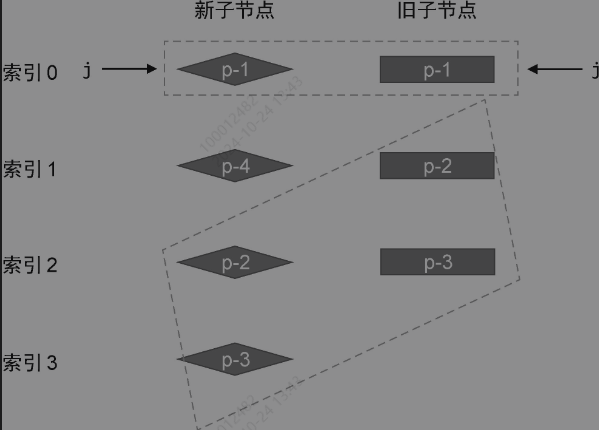
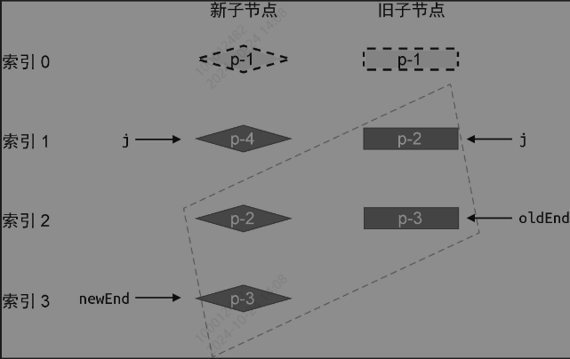

### 1.相同的前置元素和后置元素

不同于Diff算法和双端Diff算法,快速diff算法包含了预处理步骤,其实是借鉴了纯文本diff算法的思路。在纯文本diff算法中,存在对两段文本进行预处理的过程。

预处理

```js
//两段文本
let oldStr = '英雄联盟S13全球总决赛'
let newStr = '英雄联盟S14全球总决赛'
//这两个文本,就一个字不同,我们可以简单的标记为
// oldStr => 3
// newStr => 4
//只是将3换成了4

//快速diff算法也采用了预处理的步骤
```

新旧节点示例


可以看到新旧节点的首尾两部分基本一致,只是新节点在索引为1的位置多出了一个p-4

对于相同的前置节点和后置节点,由于在新旧两组节点中的相对位置不变,所以我们无需移动它们,只需要在他们之间打补丁。

对于前置节点,可以建立索引j,设置初始值为0,指向两组节点的开头



开启一个while循环,让索引js递增,直至遇到不相同的节点为止

```js
function patchKeyedChildren(n1,n2,container){
     const newChildren = n2.children
     const oldChildren = n1.children

     //处理相同的前置节点
     //索引j指向新旧两组子节点的开头

     let j = 0
     let oldVNode = oldChildren[j]
     let newVNode = newChildren[j]

     //循环后向后遍历,直至遇到用于不同key值的节点为止
     while(oldVNode.key === newVNode.key){
        //调用patch函数进行更新
        patch(oldVNode,newVNode,container)
        //索引j和对应的节点递增
        j++
        oldVNode = oldChildren[j]
        newVNode = newChildren[j]
     }
}
```

对于上面的示例来说,当j等于1的时候,遇到了p-4节点,终止了内部的while循环。接下来,需要处理相同的后置节点

由于新旧两组节点的数量可能会不同,所以需要两个索引值,分别代表两组节点的尾部索引,指向两个节点组的最后一个节点



然后再开启一个while循环,从后向前去遍历两组节点,直到遇上key值不同的节点位置

```js
function patchKeyedChildren(n1,n2,container){
    const newChildren = n2.children
    const oldChildren = n1.children

    //处理相同的前置节点
    //索引j指向新旧两组子节点的开头

    let j = 0
    let oldVNode = oldChildren[j]
    let newVNode = newChildren[j]

    //循环后向后遍历,直至遇到用于不同key值的节点为止
    while(oldVNode.key === newVNode.key){
       //调用patch函数进行更新
       patch(oldVNode,newVNode,container)
       //索引j和对应的节点递增
       j++
       oldVNode = oldChildren[j]
       newVNode = newChildren[j]
    }

    //更新相同的后置节点
    // 索引oldEnd指向旧的一组子节点的最后一个节点
    let oldEnd = oldChildren.length - 1
    //索引newEnd指向新的一组子节点的最后一个节点
    let newEnd = newChildren.length - 1

    oldVNode = oldChildren[oldEnd]
    newVNode = newChildren[newEnd]

    //while循环从后向前遍历,直到拥有不同key值的节点为止
    while(oldVNode.key === newVNode.key){
        //调用patch函数进行更新
        patch(oldVNode,newVNode,container)
        //递减 oldEnd 和 nextEnd
        oldEnd--
        newEnd--
        oldVNode = oldChildren[oldEnd]
        newVNode = newChildren[newEnd]
    }
}
```

#### 新增节点处理

当前置相同节点和后置相同节点循环完毕之后,发现旧节点组中所有的节点都已经处理完毕,在新的节点组中,还有p-4没有被处理。可以得出结论,p-4是一个新增的节点。

在程序中,可以根据这几个索引值去判断未被处理的节点

条件1. **oldEnd < j** : 说明在预处理过程中,所有旧的子节点都处理完毕了。

条件2.  **newEnd >= j** ,说明在预处理完毕后,新的节点组中还有未被处理的节点,而这些未被处理遗留的节点就是新增节点

如果条件1和条件2同时成立,说明在新的一组节点中,存在遗留节点,并且这些节点都是新增节点,需要将这些节点挂载正确的位置。


在j和newEnd之间的任何节点都需要作为新的子节点去挂载,这就需要找到正确的锚点元素。在上述案例中,很想然p-2所对应的真实DOM就是锚点元素

```js
function patchKeyedChildren(n1,n2,container){
    const newChildren = n2.children
    const oldChildren = n1.children

    //处理相同的前置节点
    //索引j指向新旧两组子节点的开头

    let j = 0
    let oldVNode = oldChildren[j]
    let newVNode = newChildren[j]

    //循环后向后遍历,直至遇到用于不同key值的节点为止
    while(oldVNode.key === newVNode.key){
       //调用patch函数进行更新
       patch(oldVNode,newVNode,container)
       //索引j和对应的节点递增
       j++
       oldVNode = oldChildren[j]
       newVNode = newChildren[j]
    }

    //更新相同的后置节点
    // 索引oldEnd指向旧的一组子节点的最后一个节点
    let oldEnd = oldChildren.length - 1
    //索引newEnd指向新的一组子节点的最后一个节点
    let newEnd = newChildren.length - 1

    oldVNode = oldChildren[oldEnd]
    newVNode = newChildren[newEnd]

    //while循环从后向前遍历,直到拥有不同key值的节点为止
    while(oldVNode.key === newVNode.key){
        //调用patch函数进行更新
        patch(oldVNode,newVNode,container)
        //递减 oldEnd 和 nextEnd
        oldEnd--
        newEnd--
        oldVNode = oldChildren[oldEnd]
        newVNode = newChildren[newEnd]
    }

    //说明找了一些需要新增的元素
    if(j>oldEnd && j<= newEnd){
        //锚点的索引
        const anchorIndex = newEnd + 1
        //锚点元素,也就是新增部分之后的那个元素
        const anchor = anchorIndex < newChildren.length?newChildren[anchorIndex].el:null
        //采用while循环,调用patch函数逐个挂载新增节点
        while(j<=newEnd){
            patch(null,newChildren[j++],container,anchor)
        }
    }
}
```

#### 删除节点处理

上面是新节点中有需要新增的元素,不过也会存在新节点元素较少,需要删除的元素

如图所示:

新节点组比旧节点组少一个p-2元素, 设置j头部索引j和各自的尾部索引newEnd和oldEnd


对比元素,并且更新索引,当旧节点组中还剩未遍历到的元素,就是需要移除的元素


需要卸载的元素集合范围, j和oldEnd之间的元素都是需要被卸载的元素


删除逻辑

```js
function patchKeyedChildren(n1,n2,container){
    const newChildren = n2.children
    const oldChildren = n1.children

    //更新相同的前置节点
    //省略部分代码

    if(j>oldEnd && j<= newEnd){
        //省略部分代码
    }else if(j>newEnd && j<= oldEnd){
        //j -> oldEnd之间的节点应该被卸载
        while(j <= oldEnd){
            unmount(oldChildren[j++])
        }
    }
}
```

### 2.判断是否需要移动DOM


无论是新节点还是旧节点,都有未处理的。新节点中的p-7,是需要新增的,旧节点的p-6是需要移除的,而且多个节点的排序也发生了变化

简单,双端,快速Diff三种算法,都尊遵循一个处理规则:

1.判断是否有节点需要移动,以及如何移动

2.找出需要被新增和删除的节点

在这种非理想的情况下,当相同的前置节点和后置节点被处理完毕后,索引j,newEnd和oldEnd不满足下面两个条件中的任何一个:

1. j> oldEnd && j<= newEnd
2. j> newEnd && j<=oldEnd

所以在这两种情况之外,还需要新增一个额外的else逻辑

思路: 构建一个狐族source,它的长度等于新的一组子节点在经过预处理之后剩余未处理节点的数量,并且source中每个元素的初始值都是-1


```js
function patchKeyedChildren(n1,n2,container){
    const newChildren = n2.children
    const oldChildren = n1.children

    //更新相同的前置节点
    //省略部分代码

    if(j>oldEnd && j<= newEnd){
        //省略部分代码
    }else if(j>newEnd && j<= oldEnd){
        //j -> oldEnd之间的节点应该被卸载
        while(j <= oldEnd){
            unmount(oldChildren[j++])
        }
    }else{
        //构造source数组:将用来存储新的一组子节点中的节点在旧的一组节点中的位置索引。后面会使用它计算出一个最长递增子序列,并用于辅助完成DOM移动的操作
        //新的一组子节点中剩余未处理节点的数量

        const count = newEnd - j + 1
        const source = new Array(count)
        source.fill(-1)

    }
}

```


由于数组source的索引从0开始的,而未处理节点的索引未必从0开始。所以在填充数组时需要使用表达式k-newStart的值作为数组的索引值。外层循环的变量i就是当前节点在旧的一组子节点中的位置索引,因此直接将变量i的值赋给source[k-newStart]即可。

当新旧节点的数量较多时,两层嵌套的循环往往会带来性能问题,处于优化的目的,可以为新的一组子节点构建一张索引表,用来存储节点的key和节点位置索引之间的映射


有了索引表,可以快速的填充source数组

```js
if(j>oldEnd && j<= newEnd){
    //省略部分代码
}else if(j>newEnd && j<= oldEnd){
   //省略部分代码
}else{
    const count = newEnd - j + 1
    const source = new Array(count)
    source.fill(-1)

    //oldStart和newStart分别为起始索引,即为j
    const oldStart = j
    const newStart = j
    //构建索引表
    const keyIndex = {}
    for(let i = newStart;i<= newEnd;i++){
        keyIndex[newChildren[i].key] = i
    }
    //遍历旧的一组子节点中剩余未处理的节点
    for(let i = oldStart;i<oldEnd;i++){
        oldVNode = oldChildren[i]
        //通过索引表快速找到新的一组子节点中具有相同key值的节点位置
        const k = keyIndex[oldVNode.key]

        if(typeof k !== 'undefined'){
            newVNode = newChildren[k]
            //调用patch函数完成更新
            patch(oldVNode,newVNode,container)
            //填充source数组
            source[k-newStart] = i
        }else{
            unmount(oldVNode)
        }
    }
}
```

使用了两个for循环,不过不再是嵌套关系,所以可以将代码的时间复杂度降至O(n)。

第一个for循环用来构建索引表,索引表存储的是节点key值与节点在新的一组子节点中位置索引之间的映射。

第二个循环用来遍历旧的一组子节点,拿旧子节点的key值去索引表keyIndex中查找该节点在新的一组子节点中的位置,并将查找结果存储到变量k中。

如果k存在,说明该节点是可复用的,调用patch函数打补丁,并且填充source数组。否则说明该节点已经不存在于新的一组子节点中,就需要调用unmount函数卸载。

source数组填充完毕后,就需要判断节点是否需要移动

```js
if(j>oldEnd && j<= newEnd){
    //省略部分代码
}else if(j>newEnd && j<= oldEnd){
   //省略部分代码
}else{
    const count = newEnd - j + 1
    const source = new Array(count)
    source.fill(-1)

    const oldStart = j
    const newStart = j

    //新增两个变量
    let moved = false
    let pos = 0

    const keyIndex = {}
    for(let i = newStart;i<= newEnd;i++){
        keyIndex[newChildren[i].key] = i
    }

    for(let i = oldStart;i<oldEnd;i++){
        oldVNode = oldChildren[i]
        const k = keyIndex[oldVNode.key]

        if(typeof k !== 'undefined'){
            newVNode = newChildren[k]
            patch(oldVNode,newVNode,container)
            source[k-newStart] = i
            //判断节点是否需要移动
            if(k<pos){
                moved = true
            }else{
                pos = k
            }
        }else{
            unmount(oldVNode)
        }
    }
}
```

新增了两个变量moved和pos。

moved代表是否需要移动节点,pos代表遍历旧的一组子节点的过程中遇到的最大索引值k。

如果在遍历过程中,遇到的索引值呈现递增趋势,说明不需要移动节点,反之则需要。所以在第二个for循环内,通过比较变量k与变量pos的值来哦按断是否需要移动节点。

此外,还需要一个数量标识,代表已经更新过的节点数量。已更新过的节点数量应该小于新的一组子节点中需要更新的节点数量。一旦前者超过后者,则说明有多余的节点,应该将其卸载

```js
 if (j > oldEnd && j <= newEnd) {
   // 省略部分代码
 } else if (j > newEnd && j <= oldEnd) {
   // 省略部分代码
 } else {
   // 构造 source 数组
   const count = newEnd - j + 1
   const source = new Array(count)
   source.fill(-1)

   const oldStart = j
   const newStart = j
   let moved = false
   let pos = 0
   const keyIndex = {}
   for(let i = newStart; i <= newEnd; i++) {
     keyIndex[newChildren[i].key] = i
   }
   // 新增 patched 变量，代表更新过的节点数量
   let patched = 0
   for(let i = oldStart; i <= oldEnd; i++) {
     oldVNode = oldChildren[i]
     // 如果更新过的节点数量小于等于需要更新的节点数量，则执行更新
     if (patched <= count) {
       const k = keyIndex[oldVNode.key]
       if (typeof k !== 'undefined') {
         newVNode = newChildren[k]
         patch(oldVNode, newVNode, container)
         // 每更新一个节点，都将 patched 变量 +1
         patched++
         source[k - newStart] = i
         if (k < pos) {
           moved = true
         } else {
           pos = k
         }
       } else {
         // 没找到
         unmount(oldVNode)
       }
     } else {
       // 如果更新过的节点数量大于需要更新的节点数量，则卸载多余的节点
       unmount(oldVNode)
     }
   }
 }
```

增加了patched变量,初始值为0,代表更新过的节点数量。记者,在第二个for循环中增加了判断patched<=count,如果此条件成立,则正常更新,并且每次更新后都能让变量patched自增;否则说明剩余的节点都是多余的,于是调用unmount函数将他们卸载。

### 3.如何移动元素

```js

if (moved) {
   const seq = lis(sources)

   // s 指向最长递增子序列的最后一个元素
   let s = seq.length - 1
   let i = count - 1
   for (i; i >= 0; i--) {
     if (source[i] === -1) {
       // 省略部分代码
     } else if (i !== seq[s]) {
       // 说明该节点需要移动
       // 该节点在新的一组子节点中的真实位置索引
       const pos = i + newStart
       const newVNode = newChildren[pos]
       // 该节点的下一个节点的位置索引
       const nextPos = pos + 1
       // 锚点
       const anchor = nextPos < newChildren.length
         ? newChildren[nextPos].el
         : null
       // 移动
       insert(newVNode.el, container, anchor)
     } else {
       // 当 i === seq[s] 时，说明该位置的节点不需要移动
       // 并让 s 指向下一个位置
       s--
     }
   }
 }


  function lis(arr) {
   const p = arr.slice()
   const result = [0]
   let i, j, u, v, c
   const len = arr.length
   for (i = 0; i < len; i++) {
     const arrI = arr[i]
     if (arrI !== 0) {
       j = result[result.length - 1]
       if (arr[j] < arrI) {
         p[i] = j
         result.push(i)
         continue
       }
       u = 0
       v = result.length - 1
       while (u < v) {
         c = ((u + v) / 2) | 0
         if (arr[result[c]] < arrI) {
           u = c + 1
         } else {
           v = c
         }
       }
       if (arrI < arr[result[u]]) {
         if (u > 0) {
           p[i] = result[u - 1]
         }
         result[u] = i
       }
     }
   }
   u = result.length
   v = result[u - 1]
   while (u-- > 0) {
     result[u] = v
     v = p[v]
   }
   return result
 }
```

### 总结


